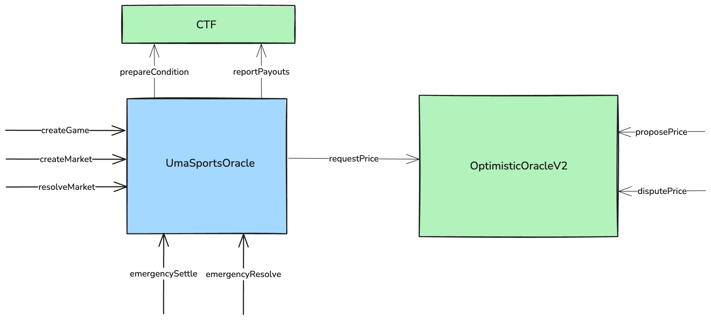

# Polymarket UMA Sports Oracle

## Overview

This repo contains contracts that use UMA's Optimistic Oracle(OO) to automatically resolve multiple Sports markets based on scores provided by the OO.

## Deployments
| Network          | Address                                                                           |
| ---------------- | --------------------------------------------------------------------------------- |
| Polygon          |[0xb21182d0494521Cf45DbbeEbb5A3ACAAb6d22093](https://polygonscan.com/address/0xb21182d0494521Cf45DbbeEbb5A3ACAAb6d22093)|

## Architecture

The UmaSportsOracle contract will allow users to create _Games_ where every Game corresponds to a unique Sports event. This contract uses the Optimistic Oracle's MULTIPLE_VALUES price identifier to fetch the scores of the home and away teams.

Once created, _Markets_ can be created that will resolve based on the scores of the Game. 
There are 3 types of markets supported by the contract at this time:

* Winner    - A market on who the winner of a Game is i.e Team A vs Team B
* Spreads   - A market on the _spread_ between the team scores i.e Favorite vs Underdog
* Totals    - A market on the _total_ score i.e Over vs Under

In short:

* Anyone can call `createGame` on the Oracle, which will:
    - Send out a price request to the OO requesting the scores for the game
    - Create a Game if it doesn’t already exist
* After a Game is created, anyone can call `createMarket` which will:
    - Prepare a new ConditionalTokensFramework Condition
    - Creates a Market on the contract if it does not already exist
* Once score data is available, proposers will:
    - Fetch the scores for the home and away teams respectively
    - Encode the scores or other data(e.g if the game was canceled) according to [UMIP 183](https://github.com/UMAprotocol/UMIPs/blob/master/UMIPs/umip-183.md)
    - Propose this value on the OO
* OO disputers can challenge this value with a bond etc and escalate to the UMA DVM
* After UMA DVM process, anyone can settle the request on the OO which will execute a callback which:
    - Decode the scores retrieved from the OO
    - Store them onchain
    - Sets the state of the Game
* Once a Game is settled or canceled, anyone can call `resolveMarket` for any of the Markets linked to the Game which will resolve the Market(s) based on the scores of the Game

## Development

Clone the repo: `git clone https://github.com/Polymarket/uma-sports-oracle.git --recurse-submodules`

---

### Set-up

Install [Foundry](https://github.com/foundry-rs/foundry/).

Foundry has daily updates, run `foundryup` to update `forge` and `cast`.

To install/update forge dependencies: `forge update`

To build contracts: `forge build`

---

### Testing

To run all tests: `forge test`
